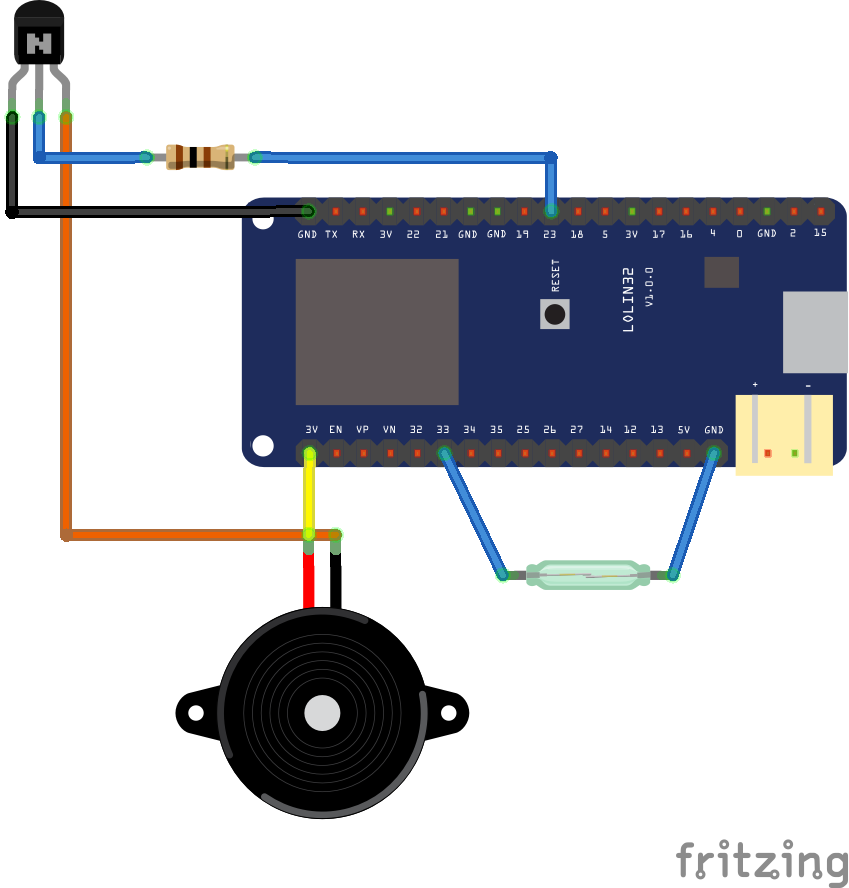

# ToiletIoT
 一個簡單IoT設備，用來提醒使用厠所的人快點解決

會有這想法是因爲在公司上班時，肚子痛想跑厠所，有時跑了幾間才發現有人正在使用，害我白跑一趟。再加上有時同事上厠所超久，所以就加了個 “緊張氣氛” 的功能讓同事快點解決！

安裝教程影片: 稍後更新

這項目是使用以下語言/協議開發的
- ASP.NET Core
- SignalR
- VueJS
- MQTT (RYC1001 物聯網雲端平台)

硬件:
- Wemos Lolin32
- NPN
- 電阻100欧
- 蜂鳴器
- 磁簧開關

電路圖:

RYC1001資料文檔鏈接: http://reyax.com/products/ryc1001/  
RYC1001 購買鏈接: http://amzn.to/3hAY5zp  
REYAX官網: http://reyax.com/product/

未解決問題:
- 讀取電池電量
- 當開門后，歌曲未能停止播放
- 睡眠模式

感謝：
- REYAX 提供物聯網雲端平台賬號
- PHianonize https://youtu.be/gVgAfXNTy7k
- Google上的各大教程